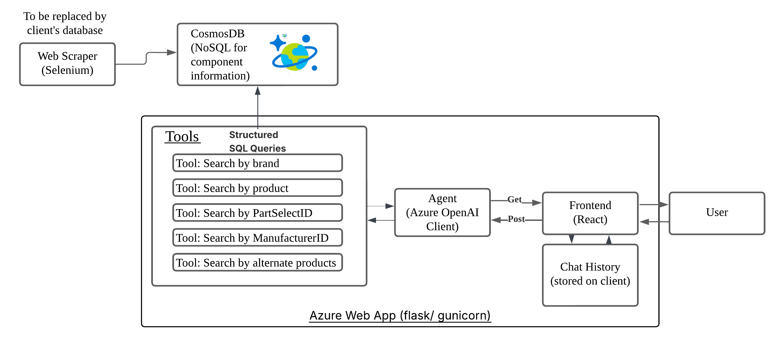

# Instalily Case Study Project

Live Demo Website:
<div>
    <a href="https://app-web-kmw2ouujgm2ke.azurewebsites.net/">
      <p>Live demo website</p>
    </a>
    <a href="https://app-web-kmw2ouujgm2ke.azurewebsites.net/">
      
    </a>
  </div>


## Key functionalities
- Scrape source website and puts information into CosmosDB
- Instead of RAG from vectorstore (not exact), RAG with SQL. This allows exact matches and cheaper retrieval
- If the user wishes to buy parts, help user narrow down part and display rendered purchase link with image
- If the user wishes for installation video, display embedded video
- If the user wishes for other information - for example x part can also be used to replace y part, etc - the agent can find that information in the NoSQL database too 


# Installation
## Create env 
conda create -n instalily python==3.11
conda activate instalily

pip install -r requirements.txt

# To deploy your web app
## Scrape
Fastest working config:
```
python ./backend/scraper/scraper.py  --verbose --no-proxy --driver Chrome
```

## Set up your Azure subscriptions
1. Create a [Azure CosmosDB account](https://learn.microsoft.com/en-us/azure/cosmos-db/nosql/quickstart-portal) 
2. Get your [Azure Deepseek-V3 Subscription](https://ai.azure.com/explore/models/deepseek-v3/version/1/registry/azureml-deepseek)
3. [Install azd](https://learn.microsoft.com/en-us/azure/developer/azure-developer-cli/install-azd)

## Deploy
```
azd up
```

Go to Azure portal for this web app -> Settings -> Configurations-> Start up command

```
gunicorn --bind=0.0.0.0 --timeout 600 startup:app
```

Make sure Python version is set to 3.11

The website will be hosted at a random domain.

# Systems diagram



# File structure
```
azure_app/
├── .azure/                          # Azure configuration files
├── .devcontainer/                   # Development container configuration
├── .github/                         # GitHub workflow configurations
├── infra/                           # Infrastructure parameters for Azure
├── static/                          # Static web assets
├── templates/                       # HTML templates
├── app.py                           # Main Flask application
├── azure_openai_agent.py            # Azure OpenAI integration
├── cosmos.py                        # CosmosDB client and operations
├── azure.yaml                       # Azure Developer CLI config
├── CHANGELOG.md                     # Release history
├── CONTRIBUTING.md                  # Contribution guidelines
├── LICENSE.md                       # License information
├── README.md                        # Project documentation
└── requirements.txt
```
